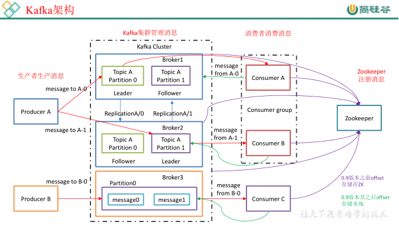
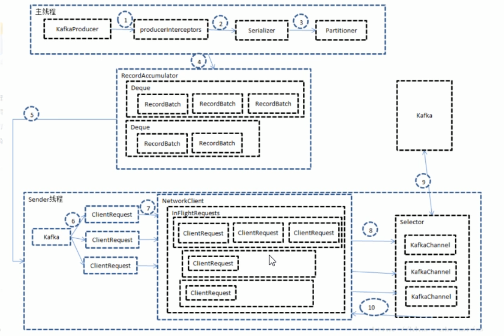

中文文档：http://kafka.apachecn.org

# 1、安装

## 1.1 、下载kafka

http://kafka.apache.org/downloads

## 1.2、配置kafka

`vim config/server.properties`

``` 
#broker 的全局唯一编号，不能重复
broker.id=0
#删除 topic 功能使能
delete.topic.enable=true
#处理网络请求的线程数量
num.network.threads=3
#用来处理磁盘 IO 的现成数量
num.io.threads=8
#发送套接字的缓冲区大小
socket.send.buffer.bytes=102400
#接收套接字的缓冲区大小
socket.receive.buffer.bytes=102400
#请求套接字的缓冲区大小
socket.request.max.bytes=104857600
#kafka 运行日志存放的路径
log.dirs=/opt/module/kafka/logs
#topic 在当前 broker 上的分区个数
num.partitions=1
#用来恢复和清理 data 下数据的线程数量
num.recovery.threads.per.data.dir=1
#segment 文件保留的最长时间，超时将被删除
log.retention.hours=168
#配置连接 Zookeeper 集群地址
zookeeper.connect=hadoop102:2181,hadoop103:2181,hadoop104:2181
```

## 1.3、下载zookeeper

## 1.4、配置zookeeper

1）、复制配置文件

`cp conf/zoo_sample.properties conf/zoo.properties`

2)、编辑配置文件 `vi conf/zoo.properties`

```

```


## 1.5、启动zookeeper

`./bin/zkServer.sh start conf/zoo.cfg`

## 1.6、启动kafka

`./bin/kafka-server-start.sh -daemon config/server.properties`

# 2、命令行使用

## 2.1、创建主题

命令： `./bin/kafka-topics.sh --zookeeper localhost:2181 --create --topic test --partitions 2 --replication-factor 1`

选项说明：
--topic 定义 topic 名
--replication-factor 定义副本数
--partitions 定义分区数

```
[root@caleb /usr/local/kafka]#./bin/kafka-topics.sh --zookeeper localhost:2181 --create --topic test --partitions 2 --replication-factor 1
Created topic test.
```

## 2.2、查看主题列表

命令： `./bin/kafka-topics.sh --zookeeper localhost:2181 --list`

```
[root@caleb /usr/local/kafka]#./bin/kafka-topics.sh --zookeeper localhost:2181 --list
test
```

## 2.3、查看主题详情

命令: `./bin/kafka-topics.sh --zookeeper localhost:2181 --describe --topic test`

```
[root@caleb /usr/local/kafka]#./bin/kafka-topics.sh --zookeeper localhost:2181 --describe --topic test
Topic: test	PartitionCount: 2	ReplicationFactor: 1	Configs: 
	Topic: test	Partition: 0	Leader: 0	Replicas: 0	Isr: 0
	Topic: test	Partition: 1	Leader: 0	Replicas: 0	Isr: 0

```

> --describe 查看详情动作命令

- “leader”是负责给定分区所有读写操作的节点。每个节点都是随机选择的部分分区的领导者。
- “replicas”是复制分区日志的节点列表，不管这些节点是leader还是仅仅活着。
- “isr”是一组“同步”replicas，是replicas列表的子集，它活着并被指到leader。

## 2.4、修改主题

```
./bin/kafka-topics.sh --zookeeper localhost:2181 --alter --topic test --config flush.message = 1

./bin/kafka-topics.sh --zookeeper localhost:2181 --alter --topic test --delete-config flush.message
```


## 2.5、启动消费端接收消息

命令： `./bin/kafka-console-consumer.sh --bootstrap-server localhost:9092 --topic test`

```
[root@caleb /usr/local/kafka]#./bin/kafka-console-consumer.sh --bootstrap-server localhost:9092 --topic test --from-beginning
的地方的地方都是对方
hello
fsfd\n
fgd

```

> --from-beginning：会把主题中以往所有的数据都读取出来。

## 2.6、发布消息

命令：`./bin/kafka-console-producer.sh --broker-list localhost:9092 --topic test`

```
[calebzhao@caleb /usr/local/kafka]$./bin/kafka-console-producer.sh --broker-list localhost:9092 --topic test
>的地方的地方都是对方
>hello
>fsfd\n
>fgd
>
```


## 2.7、修改分区数 13818248110

命令：`bin/kafka-topics.sh  --zookeeper
localhost:2181 --alter --topic test --partitions 6`

## 2.8、删除 topic

命令： `bin/kafka-topics.sh  --zookeeper
localhost:2181 --delete --topic test`


# 3、基础架构

 


1）Producer ：消息生产者，就是向kafka broker发消息的客户端；
2）Consumer ：消息消费者，向kafka broker取消息的客户端；
3）Consumer Group （CG）：消费者组，由多个consumer组成。消费者组内每个消费者负责消费不同分区的数据，一个分区只能由一个组内消费者消费；消费者组之间互不影响。
所有的消费者都属于某个消费者组，即消费者组是逻辑上的一个订阅者。
4）Broker ：一台kafka服务器就是一个broker。一个集群由多个broker组成。一个broker可以容纳多个topic。
5）Topic ：可以理解为一个队列，生产者和消费者面向的都是一个topic；
6）Partition：为了实现扩展性，一个非常大的topic可以分布到多个broker（即服务器）上，一个topic可以分为多个partition，每个partition是一个有序的队列；
7）Replica：副本，为保证集群中的某个节点发生故障时，该节点上的partition数据不丢失，8 ）leader ：每个分区多个副本的“主”，生产者发送数据的对象，以及消费者消费数据的对
象都是 leader。
9 ）follower ：每个分区多个副本中的“从”，实时从 leader 中同步数据，保持和 leader 数据
的同步。leader 发生故障时，某个 follower 会成为新的 follower。

```

```

