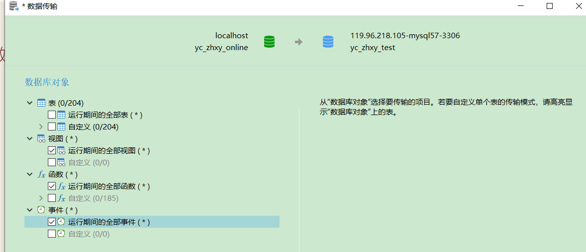

# 1、函数全部复制过去，直接覆盖



# 2、复制表


# 3、修改表结构

```sql
ALTER TABLE `power_account` ADD INDEX `idx_power_account_wechatId`(`wechatID`) USING BTREE;


ALTER TABLE `t_attendancesetting_classbrand` DROP INDEX `idx_ac_grade`;

ALTER TABLE `t_attendancesetting_classbrand` ADD COLUMN `groupId` int(11) NULL DEFAULT NULL COMMENT '时段分组id' AFTER `id`;


ALTER TABLE `t_attendancesetting_classbrand` MODIFY COLUMN `gradeCode` int(11) NULL DEFAULT NULL COMMENT '年级编码，1到12' AFTER `groupId`;

ALTER TABLE `t_attendancesetting_classbrand` MODIFY COLUMN `startTime` time(0) NULL DEFAULT NULL COMMENT '考勤开始时间' AFTER `schoolId`;

ALTER TABLE `t_attendancesetting_classbrand` MODIFY COLUMN `endTime` time(0) NULL DEFAULT NULL COMMENT '考勤结束时间' AFTER `startTime`;

ALTER TABLE `t_attendancesetting_classbrand` ADD COLUMN `chidaoTime` time(0) NULL DEFAULT NULL COMMENT '最晚迟到时间,超过该时间不计入考勤' AFTER `endTime`;

ALTER TABLE `t_attendancesetting_classbrand` MODIFY COLUMN `enabled` tinyint(1) NOT NULL DEFAULT 0 COMMENT '是否启动该考勤时段' AFTER `chidaoTime`;


ALTER TABLE `t_attendancesetting_classbrand` ADD COLUMN `stateName` varchar(10) CHARACTER SET utf8 COLLATE utf8_general_ci NULL DEFAULT NULL COMMENT '考勤类型，例如：进校、午休、离校' AFTER `onDaySetting`;

ALTER TABLE `t_attendancesetting_classbrand` ADD COLUMN `sendToGradeManager` bit(1) NOT NULL DEFAULT b'0' COMMENT '是否推送给年级组长' AFTER `stateName`;

ALTER TABLE `t_attendancesetting_classbrand` ADD COLUMN `sendToClassManager` bit(1) NOT NULL DEFAULT b'0' COMMENT '是否推送给班主任' AFTER `sendToGradeManager`;

ALTER TABLE `t_attendancesetting_classbrand` ADD COLUMN `sendToStudentParent` bit(1) NOT NULL DEFAULT b'0' COMMENT '是否推送给家长' AFTER `sendToClassManager`;

ALTER TABLE `t_attendancesetting_classbrand` ADD INDEX `idx_ac_grade`(`schoolId`, `gradeCode`, `enabled`) USING BTREE;

ALTER TABLE `t_attendancesetting_classbrand` COMMENT = '考勤时段，考勤时间规则：\r\n时段分组开始时间 --> 考勤开始时间 --> 考勤结束时间（推送年级组长、班主任）  -----班主任改考勤------> 迟到时间（班主任不能改考勤）  --> 推送校长时间  ---> 该时段分组结束时间';

ALTER TABLE `t_class_attendance` DROP INDEX `classID`;

ALTER TABLE `t_class_attendance` MODIFY COLUMN `statusDate` date NULL DEFAULT NULL AFTER `classID`;

ALTER TABLE `t_class_attendance` ADD COLUMN `startTime` time(0) NULL DEFAULT NULL COMMENT '考勤开始时间' AFTER `weather`;

ALTER TABLE `t_class_attendance` ADD COLUMN `endTime` time(0) NULL DEFAULT NULL COMMENT '考勤结束时间' AFTER `startTime`;

ALTER TABLE `t_class_attendance` ADD COLUMN `chidaoTime` time(0) NULL DEFAULT NULL COMMENT '该时段考勤迟到时间' AFTER `endTime`;

ALTER TABLE `t_class_attendance` ADD COLUMN `groupStartTime` time(0) NULL DEFAULT NULL COMMENT '考试时段分组开始时间' AFTER `chidaoTime`;

ALTER TABLE `t_class_attendance` ADD COLUMN `groupEndTime` time(0) NULL DEFAULT NULL COMMENT '考勤时段分组结束时间' AFTER `groupStartTime`;

ALTER TABLE `t_class_attendance` ADD COLUMN `groupName` varchar(20) CHARACTER SET utf8 COLLATE utf8_general_ci NULL DEFAULT NULL COMMENT '时段分组名称' AFTER `groupEndTime`;

ALTER TABLE `t_class_attendance` ADD COLUMN `attendanceSettingId` varchar(36) CHARACTER SET utf8 COLLATE utf8_general_ci NULL DEFAULT NULL COMMENT '考勤时段id' AFTER `groupName`;

ALTER TABLE `t_class_attendance` ADD INDEX `classID`(`classID`, `statusDate`, `createTime`) USING BTREE;


ALTER TABLE `t_class_attendance_detail` DROP COLUMN `xwStatus`;

ALTER TABLE `t_class_attendance_detail` DROP INDEX `idx_class_attendance_detail`;

ALTER TABLE `t_class_attendance_detail` ADD COLUMN `attendanceId` char(36) CHARACTER SET utf8 COLLATE utf8_general_ci NULL DEFAULT NULL COMMENT '考勤id' AFTER `content`;

ALTER TABLE `t_class_attendance_detail` ADD INDEX `idx_class_attendacne_detail`(`classAttendanceID`, `status`, `studentID`) USING BTREE;
```

4、登录java后台

访问/zhxy/admin/test/dbMove迁移数据

5、配置t_classbrand_attendancesetting

6、测试